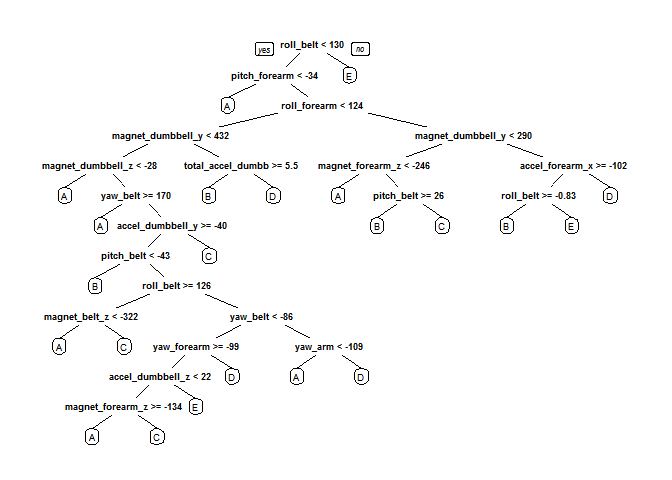

# Coursera Practical Machine Learning course project
Roderic N. Reckley  
June 6, 2016  


## Introduction
 The use of fitness and activity movement devices such as Jawbone Up, Nike FuelBand, and Fitbit have enabled individuals to collect a large volume of data associated with their daily physical activity. The emergence of fitness devices have enabled an individual to not only track the duration of their physical activity, but how well they performed it. 
  For this project, data collected from from accelerometers on the belt, forearm, arm, and dumbbell of 6 participants in a weight lifting experiment will be evaluated. As part of the experiment, each participant in the study was asked to perform 10 repetitions of the unilateral dumbbell biceps curl correctly and incorrectly[1]. Correct execution of the curl was stored in the variable class with a value of A. Incorrect execution of the curl was stored in the variable class with a value of B, C, or E.
  
  The goal of this project is to use the data collect from this experiment to build a machine learning model that can be used to predict the execution of a bicep curl. This requires an analysis of the data set, selection of a model and then using the provided data set to train the model.

### Environment Setup
   For this project, the following libraries were used. This project was performed using R-Studio version 0.99.893 and R 3.3.0 running on 64-bit windows 7 computer.
   

```r
library(caret)
library(rpart)
library(rpart.plot)
library(randomForest)
library(corrplot)
library(klaR)
```

### Data Retrival and Cleaning
   The training data set was downloaded from https://d396qusza40orc.cloudfront.net/predmachlearn/pml-training.csv
   The testing data set was downloaded from  https://d396qusza40orc.cloudfront.net/predmachlearn/pml-testing.csv


```r
setwd("C:/Users/RNRECKLEY/Downloads/coursera/datascience/machine-learning/project")
trainingFile <- "./pml-training.csv"
testingFile <- "./pml-testing.csv"
rawtrainingData <- read.csv(file=trainingFile)
rawtestingData <- read.csv(file=testingFile)
```


```r
dim(rawtrainingData)
```

```
## [1] 19622   160
```

```r
dim(rawtestingData)
```

```
## [1]  20 160
```

```r
str(rawtrainingData, list.len=20)
```

```
## 'data.frame':	19622 obs. of  160 variables:
##  $ X                       : int  1 2 3 4 5 6 7 8 9 10 ...
##  $ user_name               : Factor w/ 6 levels "adelmo","carlitos",..: 2 2 2 2 2 2 2 2 2 2 ...
##  $ raw_timestamp_part_1    : int  1323084231 1323084231 1323084231 1323084232 1323084232 1323084232 1323084232 1323084232 1323084232 1323084232 ...
##  $ raw_timestamp_part_2    : int  788290 808298 820366 120339 196328 304277 368296 440390 484323 484434 ...
##  $ cvtd_timestamp          : Factor w/ 20 levels "02/12/2011 13:32",..: 9 9 9 9 9 9 9 9 9 9 ...
##  $ new_window              : Factor w/ 2 levels "no","yes": 1 1 1 1 1 1 1 1 1 1 ...
##  $ num_window              : int  11 11 11 12 12 12 12 12 12 12 ...
##  $ roll_belt               : num  1.41 1.41 1.42 1.48 1.48 1.45 1.42 1.42 1.43 1.45 ...
##  $ pitch_belt              : num  8.07 8.07 8.07 8.05 8.07 8.06 8.09 8.13 8.16 8.17 ...
##  $ yaw_belt                : num  -94.4 -94.4 -94.4 -94.4 -94.4 -94.4 -94.4 -94.4 -94.4 -94.4 ...
##  $ total_accel_belt        : int  3 3 3 3 3 3 3 3 3 3 ...
##  $ kurtosis_roll_belt      : Factor w/ 397 levels "","-0.016850",..: 1 1 1 1 1 1 1 1 1 1 ...
##  $ kurtosis_picth_belt     : Factor w/ 317 levels "","-0.021887",..: 1 1 1 1 1 1 1 1 1 1 ...
##  $ kurtosis_yaw_belt       : Factor w/ 2 levels "","#DIV/0!": 1 1 1 1 1 1 1 1 1 1 ...
##  $ skewness_roll_belt      : Factor w/ 395 levels "","-0.003095",..: 1 1 1 1 1 1 1 1 1 1 ...
##  $ skewness_roll_belt.1    : Factor w/ 338 levels "","-0.005928",..: 1 1 1 1 1 1 1 1 1 1 ...
##  $ skewness_yaw_belt       : Factor w/ 2 levels "","#DIV/0!": 1 1 1 1 1 1 1 1 1 1 ...
##  $ max_roll_belt           : num  NA NA NA NA NA NA NA NA NA NA ...
##  $ max_picth_belt          : int  NA NA NA NA NA NA NA NA NA NA ...
##  $ max_yaw_belt            : Factor w/ 68 levels "","-0.1","-0.2",..: 1 1 1 1 1 1 1 1 1 1 ...
##   [list output truncated]
```

   The raw test and training data set each contain 160 variables. A brief review of the training data set indicates that the data set contains variable with value of NA. The data set may also contain variables that have very little influence on the model.
   
   The first step in cleaning the data is to identify what variables are considered as near variance predictors in the data set.

```r
NZVTrain <- nearZeroVar(rawtrainingData, saveMetrics = TRUE)
NZVTest <- nearZeroVar(rawtestingData, saveMetrics = TRUE)
head(NZVTrain)
```

```
##                      freqRatio percentUnique zeroVar   nzv
## X                     1.000000  100.00000000   FALSE FALSE
## user_name             1.100679    0.03057792   FALSE FALSE
## raw_timestamp_part_1  1.000000    4.26562022   FALSE FALSE
## raw_timestamp_part_2  1.000000   85.53154622   FALSE FALSE
## cvtd_timestamp        1.000668    0.10192641   FALSE FALSE
## new_window           47.330049    0.01019264   FALSE  TRUE
```

   The second step is to remove the variables identified as near zero variance predictors from the test and training data.

```r
NZVtrainingData <- rawtrainingData[, !NZVTrain$nzv]
NZVtestingData <- rawtestingData[, !NZVTest$nzv]
dim(NZVtrainingData)
```

```
## [1] 19622   100
```

```r
dim(NZVtestingData)
```

```
## [1] 20 59
```

  The third step is to remove variables with values of NA.

```r
NAtrainingData <- NZVtrainingData[, colSums(is.na(NZVtrainingData)) == 0] 
NAtestingData <- NZVtestingData[, colSums(is.na(NZVtestingData)) == 0] 
dim(NAtrainingData)
```

```
## [1] 19622    59
```

```r
dim(NAtestingData)
```

```
## [1] 20 59
```

  The final step is to remove the remaining variables that do not coronation any accelerator data.

```r
cleanedTrainData <- NAtrainingData[, c(7:59)]
cleanedTestData <- NAtestingData[, c(7:59)]
dim(cleanedTrainData)
```

```
## [1] 19622    53
```

```r
dim(cleanedTestData)
```

```
## [1] 20 53
```
  
   The cleaned data sets have reduced the number of variables form 160 to 53.
   
  A correlation matrix can verify that the remaining variables are indeed correlated.

```r
corrplot(cor(cleanedTrainData[, -length(names(cleanedTestData))]), method = "color",tl.cex = 0.5 )
```

<!-- -->


### Data Set Partitionining for model testing.
  
   For the next portion of the project, the cleaned training data is portioned into test and training sets for building and evaluating machine learning modules. A seed is used to ensure reproducibility of this project.
  

```r
set.seed(53016)
trainingPartion <- createDataPartition(y=cleanedTrainData$classe, p=0.70, list=FALSE)
ModelTrainingData <- cleanedTrainData[trainingPartion, ]
ModelTestingData <- cleanedTrainData[-trainingPartion, ]
dim(ModelTrainingData)
```

```
## [1] 13737    53
```

```r
dim(ModelTestingData)
```

```
## [1] 5885   53
```
The cleaned training data set has been split into two data sets that will be used to validate the machine learning model.

### Data Modeling

#### Decision Tree
    The first step in building the model is to look at the decision tree generated by the model training data set.

```r
TreeModel <- rpart(classe ~ ., data = ModelTrainingData, method = "class")
prp(TreeModel)
```

<!-- -->
  From the decision tree model, we can see that roll_belt is most significant covariate in the data set. 

  The complexity of the decision tree model appears

```r
PredictTreeModel <- predict(TreeModel, ModelTrainingData, type = "class")
confusionMatrix(ModelTrainingData$classe, PredictTreeModel)
```

```
## Confusion Matrix and Statistics
## 
##           Reference
## Prediction    A    B    C    D    E
##          A 3557  135   98   45   71
##          B  520 1494  263  224  157
##          C   41  271 1928  155    1
##          D  195  120  338 1476  123
##          E   89  409  258  168 1601
## 
## Overall Statistics
##                                           
##                Accuracy : 0.732           
##                  95% CI : (0.7245, 0.7394)
##     No Information Rate : 0.3204          
##     P-Value [Acc > NIR] : < 2.2e-16       
##                                           
##                   Kappa : 0.6596          
##  Mcnemar's Test P-Value : < 2.2e-16       
## 
## Statistics by Class:
## 
##                      Class: A Class: B Class: C Class: D Class: E
## Sensitivity            0.8080   0.6151   0.6683   0.7137   0.8198
## Specificity            0.9626   0.8971   0.9569   0.9335   0.9216
## Pos Pred Value         0.9107   0.5621   0.8047   0.6554   0.6341
## Neg Pred Value         0.9140   0.9156   0.9156   0.9485   0.9686
## Prevalence             0.3204   0.1768   0.2100   0.1505   0.1422
## Detection Rate         0.2589   0.1088   0.1404   0.1074   0.1165
## Detection Prevalence   0.2843   0.1935   0.1744   0.1639   0.1838
## Balanced Accuracy      0.8853   0.7561   0.8126   0.8236   0.8707
```

```r
estimated_accuracy <- postResample(PredictTreeModel, ModelTrainingData$classe)
estimated_accuracy
```

```
##  Accuracy     Kappa 
## 0.7320376 0.6596121
```

```r
sample_error <- 1 - as.numeric(confusionMatrix(ModelTrainingData$classe, PredictTreeModel)$overall[1])
sample_error
```

```
## [1] 0.2679624
```
    With an estimated accuracy of only 73%, the decision tree does not appear to be the best machine learning model to use for this particular data set. 

#### Random Forest Model
   At this point, the decision is use a random forest model with repeated cross validation. This will allow the model
  

```r
fitControl <- trainControl(method="repeatedcv", number=5, repeats=1, verboseIter=FALSE)
fitmodel <- train(classe ~ ., data=ModelTrainingData, method="rf", trControl=fitControl)
fitmodel
```

```
## Random Forest 
## 
## 13737 samples
##    52 predictor
##     5 classes: 'A', 'B', 'C', 'D', 'E' 
## 
## No pre-processing
## Resampling: Cross-Validated (5 fold, repeated 1 times) 
## Summary of sample sizes: 10987, 10991, 10991, 10990, 10989 
## Resampling results across tuning parameters:
## 
##   mtry  Accuracy   Kappa    
##    2    0.9903919  0.9878457
##   27    0.9914840  0.9892278
##   52    0.9848594  0.9808489
## 
## Accuracy was used to select the optimal model using  the largest value.
## The final value used for the model was mtry = 27.
```
 The random forest model used will sample 27 variables in order to predict classe.


####  Model testing with the ModelTrainingData set

```r
predictTrainModel <- predict(fitmodel, ModelTrainingData)
confusionMatrix(ModelTrainingData$classe, predictTrainModel)
```

```
## Confusion Matrix and Statistics
## 
##           Reference
## Prediction    A    B    C    D    E
##          A 3906    0    0    0    0
##          B    0 2658    0    0    0
##          C    0    0 2396    0    0
##          D    0    0    0 2252    0
##          E    0    0    0    0 2525
## 
## Overall Statistics
##                                      
##                Accuracy : 1          
##                  95% CI : (0.9997, 1)
##     No Information Rate : 0.2843     
##     P-Value [Acc > NIR] : < 2.2e-16  
##                                      
##                   Kappa : 1          
##  Mcnemar's Test P-Value : NA         
## 
## Statistics by Class:
## 
##                      Class: A Class: B Class: C Class: D Class: E
## Sensitivity            1.0000   1.0000   1.0000   1.0000   1.0000
## Specificity            1.0000   1.0000   1.0000   1.0000   1.0000
## Pos Pred Value         1.0000   1.0000   1.0000   1.0000   1.0000
## Neg Pred Value         1.0000   1.0000   1.0000   1.0000   1.0000
## Prevalence             0.2843   0.1935   0.1744   0.1639   0.1838
## Detection Rate         0.2843   0.1935   0.1744   0.1639   0.1838
## Detection Prevalence   0.2843   0.1935   0.1744   0.1639   0.1838
## Balanced Accuracy      1.0000   1.0000   1.0000   1.0000   1.0000
```

```r
training_accuracy <- postResample(predictTrainModel, ModelTrainingData$classe)
training_accuracy
```

```
## Accuracy    Kappa 
##        1        1
```

```r
training_error <- 1 - as.numeric(confusionMatrix(ModelTrainingData$classe, predictTrainModel)$overall[1])
training_error
```

```
## [1] 0
```
 
    The random forest model produces an estimated accuracy of 100.00% using the Model Training data set.
    The random forest model produces an out of sample error of  0% using the Model Testing data set.

    
### Model testing with the ModelTestingData set
   In this step we use the ModelTestingData set to evaluate the accuracy of the random forest based fitmodel.

```r
predictTestModel <- predict(fitmodel, ModelTestingData)
confusionMatrix(ModelTestingData$classe, predictTestModel)
```

```
## Confusion Matrix and Statistics
## 
##           Reference
## Prediction    A    B    C    D    E
##          A 1671    3    0    0    0
##          B   11 1125    3    0    0
##          C    0    4 1018    4    0
##          D    0    1   12  949    2
##          E    0    0    4    2 1076
## 
## Overall Statistics
##                                           
##                Accuracy : 0.9922          
##                  95% CI : (0.9896, 0.9943)
##     No Information Rate : 0.2858          
##     P-Value [Acc > NIR] : < 2.2e-16       
##                                           
##                   Kappa : 0.9901          
##  Mcnemar's Test P-Value : NA              
## 
## Statistics by Class:
## 
##                      Class: A Class: B Class: C Class: D Class: E
## Sensitivity            0.9935   0.9929   0.9817   0.9937   0.9981
## Specificity            0.9993   0.9971   0.9983   0.9970   0.9988
## Pos Pred Value         0.9982   0.9877   0.9922   0.9844   0.9945
## Neg Pred Value         0.9974   0.9983   0.9961   0.9988   0.9996
## Prevalence             0.2858   0.1925   0.1762   0.1623   0.1832
## Detection Rate         0.2839   0.1912   0.1730   0.1613   0.1828
## Detection Prevalence   0.2845   0.1935   0.1743   0.1638   0.1839
## Balanced Accuracy      0.9964   0.9950   0.9900   0.9953   0.9984
```

```r
testing_accuracy <- postResample(predictTestModel, ModelTestingData$classe)
testing_accuracy
```

```
##  Accuracy     Kappa 
## 0.9921835 0.9901114
```

```r
testing_error <- 1 - as.numeric(confusionMatrix(ModelTestingData$classe, predictTestModel)$overall[1])
testing_error
```

```
## [1] 0.007816483
```
    The random forest model produces an estimated accuracy of 99.17% using the Model Testing data set.
    The random forest model produces an out of sample error of  0.82% using the Model Testing data set.
    
    The random forest model appears to be very accurate for predicting the outcome of the classe variable.

### Prediction Assignment
  The final part of the project is predict the exercise performed in cleaned test data set. The random forest base fitmodel is used to predict the exercises performed.

```r
finalResult <- predict(fitmodel, cleanedTestData)
finalResult
```

```
##  [1] B A B A A E D B A A B C B A E E A B B B
## Levels: A B C D E
```
   A score of 20 out of 20 was received when the results were submitted to quiz online for grading.
   
## Conclusion
   The random forest based model generated for this project proved to be extremely accurate in predicting the exercises performed in the provided test data set. The high accuracy of the model can possibly be explained by the fact that the participants were coached in how to perform each task.

### References
[1] Velloso, E.; Bulling, A.; Gellersen, H.; Ugulino, W.; Fuks, H. Qualitative Activity Recognition of Weight Lifting Exercises. Proceedings of 4th International Conference in Cooperation with SIGCHI (Augmented Human '13) . Stuttgart, Germany: ACM SIGCHI, 2013.


