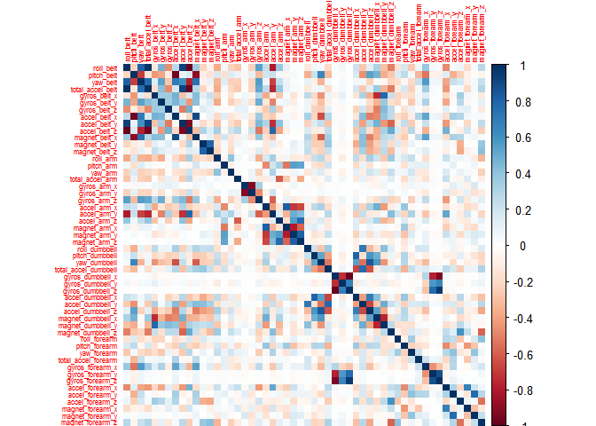

# Coursera Practical Machine Learning courser project
Roderic N. Reckley  
June 6, 2016  


## 

This is an R Markdown document. Markdown is a simple formatting syntax for authoring HTML, PDF, and MS Word documents. For more details on using R Markdown see <http://rmarkdown.rstudio.com>.

When you click the **Knit** button a document will be generated that includes both content as well as the output of any embedded R code chunks within the document. You can embed an R code chunk like this:


```r
library(caret)
library(rpart)
library(rpart.plot)
library(randomForest)
library(corrplot)
library(klaR)
```


```r
setwd("C:/Users/RNRECKLEY/Downloads/coursera/datascience/machine-learning/project")
trainingFile <- "./pml-training.csv"
testingFile <- "./pml-testing.csv"
rawtrainingData <- read.csv(file=trainingFile)
rawtestingData <- read.csv(file=testingFile)
```


```r
sum(complete.cases(rawtrainingData))
```

```
## [1] 406
```

```r
dim(rawtrainingData)
```

```
## [1] 19622   160
```

```r
dim(rawtestingData)
```

```
## [1]  20 160
```


```r
NZVTrain <- nearZeroVar(rawtrainingData, saveMetrics = TRUE)
NZVTest <- nearZeroVar(rawtestingData, saveMetrics = TRUE)
dim(NZVTrain)
```

```
## [1] 160   4
```

```r
dim(NZVTest)
```

```
## [1] 160   4
```

```r
str(NZVTrain,list.len=20)
```

```
## 'data.frame':	160 obs. of  4 variables:
##  $ freqRatio    : num  1 1.1 1 1 1 ...
##  $ percentUnique: num  100 0.0306 4.2656 85.5315 0.1019 ...
##  $ zeroVar      : logi  FALSE FALSE FALSE FALSE FALSE FALSE ...
##  $ nzv          : logi  FALSE FALSE FALSE FALSE FALSE TRUE ...
```


```r
NZVtrainingData <- rawtrainingData[, !NZVTrain$nzv]
NZVtestingData <- rawtestingData[, !NZVTest$nzv]
dim(NZVtrainingData)
```

```
## [1] 19622   100
```

```r
dim(NZVtestingData)
```

```
## [1] 20 59
```


```r
NAtrainingData <- NZVtrainingData[, colSums(is.na(NZVtrainingData)) == 0] 
NAtesttingData <- NZVtestingData[, colSums(is.na(NZVtestingData)) == 0] 
```


```r
cleanedTrainData <- NAtrainingData[, c(7:59)]
cleanedTestData <- NAtesttingData[, c(7:59)]
```


```r
set.seed(53016)
trainingPartion <- createDataPartition(y=cleanedTrainData$classe, p=0.70, list=FALSE)
ModelTrainingData <- cleanedTrainData[trainingPartion, ]
ModelTestingData <- cleanedTrainData[-trainingPartion, ]
dim(ModelTrainingData)
```

```
## [1] 13737    53
```

```r
dim(ModelTestingData)
```

```
## [1] 5885   53
```


```r
corrplot(cor(ModelTrainingData[, -length(names(ModelTrainingData))]), method = "color",tl.cex = 0.5 )
```

<!-- -->


```r
TreeModel <- rpart(classe ~ ., data = ModelTrainingData, method = "class")
prp(TreeModel)
```

<!-- -->

m

```r
PredictTreeModel <- predict(TreeModel, ModelTrainingData, type = "class")
confusionMatrix(ModelTrainingData$classe, PredictTreeModel)
```

```
## Confusion Matrix and Statistics
## 
##           Reference
## Prediction    A    B    C    D    E
##          A 3557  135   98   45   71
##          B  520 1494  263  224  157
##          C   41  271 1928  155    1
##          D  195  120  338 1476  123
##          E   89  409  258  168 1601
## 
## Overall Statistics
##                                           
##                Accuracy : 0.732           
##                  95% CI : (0.7245, 0.7394)
##     No Information Rate : 0.3204          
##     P-Value [Acc > NIR] : < 2.2e-16       
##                                           
##                   Kappa : 0.6596          
##  Mcnemar's Test P-Value : < 2.2e-16       
## 
## Statistics by Class:
## 
##                      Class: A Class: B Class: C Class: D Class: E
## Sensitivity            0.8080   0.6151   0.6683   0.7137   0.8198
## Specificity            0.9626   0.8971   0.9569   0.9335   0.9216
## Pos Pred Value         0.9107   0.5621   0.8047   0.6554   0.6341
## Neg Pred Value         0.9140   0.9156   0.9156   0.9485   0.9686
## Prevalence             0.3204   0.1768   0.2100   0.1505   0.1422
## Detection Rate         0.2589   0.1088   0.1404   0.1074   0.1165
## Detection Prevalence   0.2843   0.1935   0.1744   0.1639   0.1838
## Balanced Accuracy      0.8853   0.7561   0.8126   0.8236   0.8707
```

```r
estimated_accuracy <- postResample(PredictTreeModel, ModelTrainingData$classe)
estimated_accuracy
```

```
##  Accuracy     Kappa 
## 0.7320376 0.6596121
```

```r
sample_error <- 1 - as.numeric(confusionMatrix(ModelTrainingData$classe, PredictTreeModel)$overall[1])
sample_error
```

```
## [1] 0.2679624
```

### Model Seclection

```r
fitControl <- trainControl(method="repeatedcv", number=5, repeats=1, verboseIter=FALSE)
fitmodel <- train(classe ~ ., data=ModelTrainingData, method="rf", trControl=fitControl, ntree=250)
fitmodel
```

```
## Random Forest 
## 
## 13737 samples
##    52 predictor
##     5 classes: 'A', 'B', 'C', 'D', 'E' 
## 
## No pre-processing
## Resampling: Cross-Validated (5 fold, repeated 1 times) 
## Summary of sample sizes: 10987, 10991, 10991, 10990, 10989 
## Resampling results across tuning parameters:
## 
##   mtry  Accuracy   Kappa    
##    2    0.9902464  0.9876614
##   27    0.9914838  0.9892277
##   52    0.9847137  0.9806645
## 
## Accuracy was used to select the optimal model using  the largest value.
## The final value used for the model was mtry = 27.
```

### Model testing with the ModelTrainingData set

```r
predictTrainModel <- predict(fitmodel, ModelTrainingData)
confusionMatrix(ModelTrainingData$classe, predictTrainModel)
```

```
## Confusion Matrix and Statistics
## 
##           Reference
## Prediction    A    B    C    D    E
##          A 3906    0    0    0    0
##          B    0 2658    0    0    0
##          C    0    0 2396    0    0
##          D    0    0    0 2252    0
##          E    0    0    0    0 2525
## 
## Overall Statistics
##                                      
##                Accuracy : 1          
##                  95% CI : (0.9997, 1)
##     No Information Rate : 0.2843     
##     P-Value [Acc > NIR] : < 2.2e-16  
##                                      
##                   Kappa : 1          
##  Mcnemar's Test P-Value : NA         
## 
## Statistics by Class:
## 
##                      Class: A Class: B Class: C Class: D Class: E
## Sensitivity            1.0000   1.0000   1.0000   1.0000   1.0000
## Specificity            1.0000   1.0000   1.0000   1.0000   1.0000
## Pos Pred Value         1.0000   1.0000   1.0000   1.0000   1.0000
## Neg Pred Value         1.0000   1.0000   1.0000   1.0000   1.0000
## Prevalence             0.2843   0.1935   0.1744   0.1639   0.1838
## Detection Rate         0.2843   0.1935   0.1744   0.1639   0.1838
## Detection Prevalence   0.2843   0.1935   0.1744   0.1639   0.1838
## Balanced Accuracy      1.0000   1.0000   1.0000   1.0000   1.0000
```


### Model testing with the ModelTestingData set
   In this step we use the ModelTestingData set to evaluate the accuracy of the random forest based fitmodel.

```r
predictTestModel <- predict(fitmodel, ModelTestingData)
confusionMatrix(ModelTestingData$classe, predictTestModel)
```

```
## Confusion Matrix and Statistics
## 
##           Reference
## Prediction    A    B    C    D    E
##          A 1671    3    0    0    0
##          B   11 1124    4    0    0
##          C    0    5 1018    3    0
##          D    0    1   13  948    2
##          E    0    0    4    2 1076
## 
## Overall Statistics
##                                          
##                Accuracy : 0.9918         
##                  95% CI : (0.9892, 0.994)
##     No Information Rate : 0.2858         
##     P-Value [Acc > NIR] : < 2.2e-16      
##                                          
##                   Kappa : 0.9897         
##  Mcnemar's Test P-Value : NA             
## 
## Statistics by Class:
## 
##                      Class: A Class: B Class: C Class: D Class: E
## Sensitivity            0.9935   0.9921   0.9798   0.9948   0.9981
## Specificity            0.9993   0.9968   0.9983   0.9968   0.9988
## Pos Pred Value         0.9982   0.9868   0.9922   0.9834   0.9945
## Neg Pred Value         0.9974   0.9981   0.9957   0.9990   0.9996
## Prevalence             0.2858   0.1925   0.1766   0.1619   0.1832
## Detection Rate         0.2839   0.1910   0.1730   0.1611   0.1828
## Detection Prevalence   0.2845   0.1935   0.1743   0.1638   0.1839
## Balanced Accuracy      0.9964   0.9944   0.9891   0.9958   0.9984
```
 

### Prediction Assignment
  The final part of the project is predict the exercise performed in cleaned test data set. The radnom forest base fitmodel is used to predict the excercies performed.

```r
finalResult <- predict(fitmodel, cleanedTestData)
finalResult
```

```
##  [1] B A B A A E D B A A B C B A E E A B B B
## Levels: A B C D E
```
   A score of 20 out of 20 was recevied when the results were submitted to quiz online for grading.
   
### Conclusion
   The random forest based model generated for this project proved to be extremly accurate in prediciting the excercises performed in the provided test data set. 
